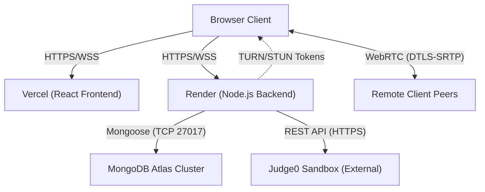

# CollabIDE Production Deployment Architecture

| Version | Date       | Author (Softex Agent ID) | Description of Changes                                       | Status   |
| :------ | :--------- | :----------------------- | :----------------------------------------------------------- | :------- |
| v1.0    | 2026-07-28 | `deployment_architect`   | Initial specification for Vercel/Render cloud migration and environment injection. | Approved |

## 1. Introduction (ISO/IEC/IEEE 42010 Architecture Description)
This document outlines the production deployment architecture of the CollabIDE system, detailing the shift from local development tunnels to a scalable, persistent cloud infrastructure. 

## 2. Deployment Viewpoint
The system utilizes a decoupled frontend and backend deployment strategy to maximize scalability and reduce latency.

### 2.1 Infrastructure Diagram

### 2.2 System Components
- **Frontend (Vercel):** Serves the static Vite/React bundle. API and WebSocket target URLs are resolved dynamically.
- **Backend (Render):** Hosts the Express API and Socket.IO/ws relay server. Controlled via `render.yaml` infrastructure-as-code configuration.
- **Database (MongoDB Atlas):** Primary persistence store utilizing the specific `replicaSet=atlas-vy5m0v-shard-0` cluster.

## 3. Secrets & Environment Management
In compliance with **[NFR-27] Secrets Management**, sensitive credentials have been removed from local-only `.env` files and are now dynamically injected into the Render environment via `render.yaml`.
- `TURN_SECRET`: Required for generating time-limited credentials per **[NFR-30] TURN Server Credential Security**.
- `JUDGE0_API_KEY`: Required for executing remote sandboxed code containers per **[FR-27] Run Code**.
- `MONGODB_URI`: Secure connection string ensuring database isolation.

## 4. Security & Role Enforcement Updates
In alignment with **[NFR-18] Server-Side Role Enforcement** and client-side isolation rules, the "Viewer" role has been strictly locked down on the client interface via DOM event interception (`onKeyDown`, `contextmenu`). This prevents unauthorized code modifications and clipboard bypasses while maintaining the background Yjs CRDT synchronization loop intact.
