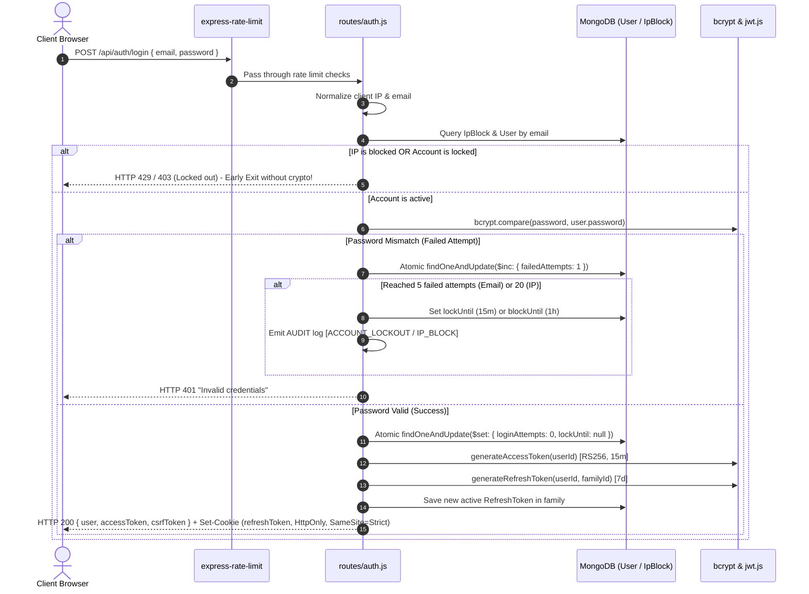
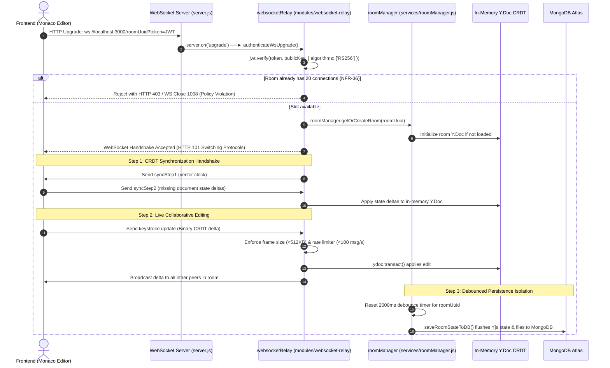

# CollabIDE — Codebase Execution Flow & Architecture Guide (flow.md)

This document maps how execution travels throughout the **CollabIDE** codebase. It details **entry points**, **initialization order**, **exact function call graphs**, **real-time protocols**, and an **itemized inventory of every change made by AI**.

---

## Table of Contents
1. [Mental Model & Dual-Engine Architecture](#1-mental-model--dual-engine-architecture)
2. [Code Entry Points](#2-code-entry-points)
3. [Server Boot & Initialization Flow (Step-by-Step)](#3-server-boot--initialization-flow-step-by-step)
4. [Primary Runtime Execution Flows](#4-primary-runtime-execution-flows)
   - [Flow A: Authentication & Brute-Force Lockout (`POST /api/auth/login`)](#flow-a-authentication--brute-force-lockout-post-apiauthlogin)
   - [Flow B: Refresh Token Rotation & Session Replay Detection (`POST /api/auth/refresh`)](#flow-b-refresh-token-rotation--session-replay-detection-post-apiauthrefresh)
   - [Flow C: Real-Time Collaborative Editing (Yjs CRDT over WebSocket)](#flow-c-real-time-collaborative-editing-yjs-crdt-over-websocket)
   - [Flow D: Remote Code Execution Sandbox (`POST /api/execution/run`)](#flow-d-remote-code-execution-sandbox-post-apiexecutionrun)
   - [Flow E: WebRTC Voice Communication Flow](#flow-e-webrtc-voice-communication-flow)
   - [Flow F: Graceful Server Shutdown Lifecycle (`SIGTERM` / `SIGINT`)](#flow-f-graceful-server-shutdown-lifecycle-sigterm--sigint)
5. [Complete Inventory of AI-Created & AI-Modified Code](#5-complete-inventory-of-ai-created--ai-modified-code)

---

## 1. Mental Model & Dual-Engine Architecture

CollabIDE operates as a **dual-engine server** coupled to a React single-page frontend:

```
                                 ┌─────────────────────────┐
                                 │   Browser (React/Vite)  │
                                 └────────────┬────────────┘
                                              │
                      ┌───────────────────────┴───────────────────────┐
                      │                                               │
               HTTP Requests                                  Persistent WebSockets
       (REST, Auth, Execution, Health)                      (Yjs CRDT & Voice Signalling)
                      │                                               │
                      ▼                                               ▼
          ┌───────────────────────┐                       ┌───────────────────────┐
          │  Express.js Engine    │                       │   WebSocket Engine    │
          │  - Middlewares        │                       │  - y-websocket Relay  │
          │  - REST Routes        │                       │  - RoomManager        │
          │  - Error Sanitizer    │                       │  - Socket.IO (/voice) │
          └───────────┬───────────┘                       └───────────┬───────────┘
                      │                                               │
                      ▼                                               ▼
          ┌───────────────────────┐                       ┌───────────────────────┐
          │     MongoDB Atlas     │ ◄──────────────────── │  In-Memory Y.Doc CRDT │
          │  (Connection Pool)    │   Debounced Flushes   │    (20 clients/room)  │
          └───────────────────────┘                       └───────────────────────┘
```

1. **Stateful Real-Time Core**: Live code editing is **not** written to the database on every keystroke. Instead, keystrokes are merged in-memory using Conflict-Free Replicated Data Types (Yjs CRDTs). The server debounces these updates and periodically flushes compressed document state to MongoDB Atlas.
2. **Stateless REST Layer**: Authentication, user profiles, room metadata, and code execution requests are stateless HTTP endpoints secured by RS256 asymmetric JWTs and double-submit CSRF tokens.

---

## 2. Code Entry Points

| Subsystem | Entry Point File | Invocation Trigger / Command | Responsibility |
| :--- | :--- | :--- | :--- |
| **Backend Cluster** | [collab-ide/ecosystem.config.js](file:///c:/Users/maazt/Documents/Collab-IDE/collab-ide/ecosystem.config.js) | `npm run pm2:start` / `pm2 start` | Spawns one Node.js worker per CPU core, sets 512MB RAM ceiling, configures logrotate. |
| **Backend Node Server** | [collab-ide/server.js](file:///c:/Users/maazt/Documents/Collab-IDE/collab-ide/server.js) | `node server.js` | Direct Node process bootstrapper. Validates environment, opens DB pool, starts HTTP + WS. |
| **Frontend Web App** | [frontend/src/main.jsx](file:///c:/Users/maazt/Documents/Collab-IDE/frontend/src/main.jsx) | `index.html` $\to$ browser load | Injects React Virtual DOM root into `#root` DOM element in `StrictMode`. |
| **Frontend Router/Root** | [frontend/src/App.jsx](file:///c:/Users/maazt/Documents/Collab-IDE/frontend/src/App.jsx) | Mounted by `main.jsx` | Authenticates session via cookie, checks URL deep-links (`?room=`), toggles views. |
| **Reverse Proxy** | [nginx/conf.d/collabide.conf](file:///c:/Users/maazt/Documents/Collab-IDE/nginx/conf.d/collabide.conf) | `nginx` daemon | Terminates TLS, proxies `/api` and WebSockets, serves precompressed static assets. |
| **PM2 Module Setup** | [collab-ide/scripts/setup_pm2.js](file:///c:/Users/maazt/Documents/Collab-IDE/collab-ide/scripts/setup_pm2.js) | `npm run pm2:setup` | Validates ecosystem schema and applies `pm2-logrotate` module settings via API. |
| **Application Log Maintenance** | [collab-ide/scripts/rotate_app_logs.js](file:///c:/Users/maazt/Documents/Collab-IDE/collab-ide/scripts/rotate_app_logs.js) | `npm run logs:rotate` / cron | Rotates `app.log`, `error.log`, `audit.log` and purges archives older than 14 days. |
| **Key Rotation Utility** | [collab-ide/scripts/rotate_encryption_key.js](file:///c:/Users/maazt/Documents/Collab-IDE/collab-ide/scripts/rotate_encryption_key.js) | CLI offline command | Rotates AES-256 field encryption keys and re-hashes blind search indexes in MongoDB. |
| **Static Precompression** | [frontend/scripts/precompress.js](file:///c:/Users/maazt/Documents/Collab-IDE/frontend/scripts/precompress.js) | `npm run build` | Generates `.br` and `.gz` static sidecars ahead of time for 0% runtime CPU usage. |

---

## 3. Server Boot & Initialization Flow (Step-by-Step)

When a worker process boots from `collab-ide/server.js`, execution strictly follows this serial pipeline:

```
[ server.js Line 18 ] ──► Load .env
           │
           ▼
[ server.js Line 24 ] ──► config/env.js: validateEnv()
                          └─► Missing/weak key? Print banner & process.exit(1)
           │
           ▼
[ server.js Line 29 ] ──► utils/logger.js: installGlobalInterceptor()
                          └─► Intercepts console logs; redacts secrets; sets 0640 permissions
           │
           ▼
[ server.js Line 42 ] ──► modules/index.js (Modular Domain Decoupling - NFR-48)
                          ├─► auth
                          ├─► rooms
                          ├─► execution
                          ├─► voiceSignalling
                          └─► infrastructure
           │
           ▼
[ server.js Line 51 ] ──► config/db.js: connectDB()
                          └─► Establishes persistent Mongoose pool (min: 5, max: 20)
           │
           ▼
[ server.js Line 62 ] ──► http.createServer(app) & Socket.IO initialization
                          └─► Attaches /voice namespace; verifies RS256 token in handshake
           │
           ▼
[ server.js Line 104] ──► Register Global Middlewares
                          ├─► Ingress shutdown barrier (503 if isShuttingDown)
                          ├─► cors()
                          ├─► compression() (threshold: 1KB)
                          ├─► express.json()
                          ├─► cookieParser()
                          ├─► csrfProtection (Double-submit cookie validation)
                          └─► express.static() (1-year immutable for hashed assets; no-cache for HTML)
           │
           ▼
[ server.js Line 170] ──► Mount REST Routes
                          ├─► /api/auth       (routes/auth.js)
                          ├─► /api/rooms      (routes/rooms.js)
                          ├─► /api/execution  (routes/execution.js)
                          ├─► /api/voice      (routes/voice.js)
                          └─► /health         (routes/health.js)
           │
           ▼
[ server.js Line 199] ──► Register Global Error Handler (Plain-English sanitizer - NFR-47)
           │
           ▼
[ server.js Line 206] ──► websocketRelay.initWebSocketRelay()
                          └─► Attaches WebSocket server to HTTP server 'upgrade' event
           │
           ▼
[ server.js Line 228] ──► Trap Process Signals (SIGTERM, SIGINT, IPC message 'shutdown')
           │
           ▼
[ server.js Line 343] ──► server.listen(PORT) ──► process.send('ready') (Notifies PM2)
```

---

## 4. Primary Runtime Execution Flows

### Flow A: Authentication & Brute-Force Lockout (`POST /api/auth/login`)

This flow handles user credential validation, protects against password guessing with atomic counters, and issues secure session tokens.



#### Function Call Chain:
1. `app.use('/api/auth', auth.routes)` $\to$ matches `router.post('/login')` in [routes/auth.js](file:///c:/Users/maazt/Documents/Collab-IDE/collab-ide/routes/auth.js#L140).
2. `authLimiter(req, res, next)` checks general IP throttle.
3. Pre-auth check: calls `checkIpBlock(clientIp)` in [models/IpBlock.js](file:///c:/Users/maazt/Documents/Collab-IDE/collab-ide/models/IpBlock.js).
4. `User.findOne({ email })` retrieves user record.
5. Account status check: `checkAccountLock(user)` checks `lockUntil`.
6. Password evaluation: `bcrypt.compare(password, user.password)`.
7. **On Failure**: `recordFailedLogin(user, clientIp)`:
   - Uses `User.findOneAndUpdate({ _id: user._id }, { $inc: { loginAttempts: 1 } })` (eliminating read-modify-save race conditions).
   - If count $\ge 5$, sets `lockUntil = Date.now() + 15 * 60 * 1000`.
   - Uses `IpBlock.findOneAndUpdate({ ip: clientIp }, { $inc: { failedAttempts: 1 } })`.
   - If IP count $\ge 20$, sets `blockUntil = Date.now() + 60 * 60 * 1000`.
8. **On Success**: `recordSuccessfulLogin(user, clientIp)` resets counters to 0.
9. Token generation: `generateAccessToken(user._id)` (RS256) and `generateRefreshToken(user._id, familyId)`.
10. Cookie emission: `res.cookie('refreshToken', token, { httpOnly: true, sameSite: 'strict', secure: true })`.

---

### Flow B: Refresh Token Rotation & Session Replay Detection (`POST /api/auth/refresh`)

This flow issues new access tokens without asking the user to re-enter their password, while detecting token theft.

```
Client sends POST /api/auth/refresh (Cookie: refreshToken)
   │
   ▼
Read cookie & verify JWT cryptographic signature (RS256)
   │
   ▼
Query database for RefreshToken by token string & familyId
   │
   ├──► Case 1: Token Found AND isRotated == true (THEFT / REPLAY ATTACK!)
   │      │
   │      ▼
   │    Log [TOKEN_REPLAY_ATTACK]
   │    Delete ALL tokens belonging to familyId (Revoke entire device tree!)
   │    Clear refreshToken cookie
   │    Return HTTP 403 Forbidden ("Session compromised. Please log in again.")
   │
   ├──► Case 2: Token Not Found / Expired
   │      │
   │      ▼
   │    Return HTTP 401 Unauthorized ("Invalid session")
   │
   └──► Case 3: Token Found AND isRotated == false (LEGITIMATE USER)
          │
          ▼
        Mark current token as isRotated = true
        Issue new child RefreshToken with SAME familyId
        Issue new AccessToken (15m) + new CSRF token
        Set updated refreshToken cookie
        Return HTTP 200 { accessToken, csrfToken }
```

---

### Flow C: Real-Time Collaborative Editing (Yjs CRDT over WebSocket)

This flow connects a user to a collaborative workspace, syncs the document tree, and broadcasts edits.



#### Function Call Chain:
1. Client initializes: `new WebsocketProvider(WS_URL, roomUuid, ydoc)` in [frontend/src/components/WorkspaceView.jsx](file:///c:/Users/maazt/Documents/Collab-IDE/frontend/src/components/WorkspaceView.jsx).
2. HTTP server traps upgrade: `server.on('upgrade')` in [collab-ide/server.js](file:///c:/Users/maazt/Documents/Collab-IDE/collab-ide/server.js).
3. `authenticateWsUpgrade(req)` verifies RS256 token and checks user membership in `Room`.
4. `roomManager.getOrCreateRoom(roomUuid)` in [services/roomManager.js](file:///c:/Users/maazt/Documents/Collab-IDE/collab-ide/services/roomManager.js#L140):
   - Asserts `room.clients.size < 20` (NFR-36 ceiling).
   - If not in memory, instantiates `new Y.Doc()` and loads persisted files from MongoDB `Room.files`.
5. Connection accepted: `wss.on('connection', (ws, req) => handleWsConnection(ws, req))` in [modules/websocket-relay/index.js](file:///c:/Users/maazt/Documents/Collab-IDE/collab-ide/modules/websocket-relay/index.js).
6. Sync initialization: `syncProtocol.writeSyncStep1(encoder, ydoc)` sends server state vector.
7. Client responds with `messageYjsSyncStep2`: `syncProtocol.readSyncMessage(decoder, encoder, ydoc, ws)`.
8. When client types:
   - `ws.on('message', data => ...)`:
   - Checks `data.byteLength <= MAX_WS_FRAME_BYTES` (512KB cap).
   - Rate limits client (`max 100 msg/sec`).
   - Parses message type: `messageYjsUpdate`.
   - `Y.applyUpdate(ydoc, update)` merges delta.
   - `broadcastToRoom(roomUuid, data, excludeWs)` mirrors update to all peer sockets.
   - Schedules debounced persistence: `roomManager.scheduleRoomPersistence(roomUuid)`.
9. Persistence fires after 2000ms idle: `saveRoomStateToDB(roomUuid, ydoc)` converts Yjs text streams to MongoDB `room.files` array.

---

### Flow D: Remote Code Execution Sandbox (`POST /api/execution/run`)

This flow safely executes code written in the collaborative workspace inside an isolated remote sandbox.

```
Client clicks "Run Code" ──► POST /api/execution/run { roomUuid, language, code, stdin }
                                  │
                                  ▼
                     protect middleware (JWT Auth)
                                  │
                                  ▼
                Rate Limiter: max 10 runs / min / user
                                  │
                                  ▼
               Role Guard: Check User Role in Room
               ├─► Viewer role? ──► HTTP 403 Forbidden (Blocked!)
               └─► Editor / Room Leader / Owner? ──► Permitted!
                                  │
                                  ▼
       Language Guard: Validate against LANGUAGE_MAP
       ├─► HTML/CSS? ──► Return id: null (Handled client-side in iframe sandbox)
       └─► JS / Python / C++ / Java? ──► Validated runtime ID
                                  │
                                  ▼
            Submit to Judge0 API (with AbortSignal timeout)
            POST https://judge0-ce.p.rapidapi.com/submissions?wait=true
            - cpu_time_limit: 10.0s
            - wall_time_limit: 12.0s
            - memory_limit: 128MB
            - max_file_size: 64KB
                                  │
                                  ▼
                      Judge0 Sandbox Execution
                                  │
                                  ▼
                 Process Execution Outcome:
                 ├─► Status 3: Accepted (Success)
                 ├─► Status 5: Time Limit Exceeded
                 ├─► Status 6: Compilation Error
                 └─► Status 7-12: Runtime Error
                                  │
                                  ▼
              Broadcast outcome to room WebSockets live
                                  │
                                  ▼
             Persist result in Room.executionHistory (max 20)
                                  │
                                  ▼
                 Return HTTP 200 { stdout, stderr, compile_output, time, memory, status }
```

#### Function Call Chain:
1. `router.post('/run', protect, execLimiter, executeHandler)` in [routes/execution.js](file:///c:/Users/maazt/Documents/Collab-IDE/collab-ide/routes/execution.js#L95).
2. `protect(req, res, next)` validates access token and attaches `req.user`.
3. Check role: `Room.findOne({ uuid: roomUuid })` $\to$ `getMemberRole(room, req.user.userId)`. If `'Viewer'`, halts with 403.
4. Payload check: maps language string to `LANGUAGE_MAP[language].id`.
5. External execution: `fetch(JUDGE0_API_URL + '/submissions?wait=true', { signal: AbortSignal.timeout(15000), ... })`.
6. Output sanitization: caps stdout/stderr buffers at 64KB to avoid memory bloat.
7. Broadcast: `broadcastToRoom(roomUuid, JSON.stringify({ type: 'EXECUTION_RESULT', result }))`.
8. History storage: pushes result to `room.executionHistory`, slices to `MAX_EXEC_HISTORY = 20`, and calls `room.save()`.
9. Sends JSON response to caller.

---

### Flow E: WebRTC Voice Communication Flow

This flow negotiates peer-to-peer audio connections between developers in a room using WebRTC mesh architecture.

```
Step 1: Ephemeral Credential Issuance
  Client ──► GET /api/voice/credentials
  Server ──► HMAC-SHA1 generates Coturn username & password (1-hour expiry)
  Server ──► Returns ICE server configuration list (STUN + TURN)

Step 2: Signalling Handshake over Socket.IO
  Client ──► socket.connect('/voice', { auth: { token: JWT } })
  Server ──► jwt.verify(token, publicKey) validates user identity
  Client ──► socket.emit('join-room', { roomUuid, displayName })
  Server ──► Adds socket to Socket.IO room channel; broadcasts 'user-joined' to peers

Step 3: WebRTC Mesh Peer Connection
  New Client creates RTCPeerConnection(iceServers) for every existing peer:
  Peer A creates Offer ──► socket.emit('voice-offer') ──► Server relays to Peer B
  Peer B receives Offer ──► Creates Answer ──► socket.emit('voice-answer') ──► Server relays to Peer A
  Both peers exchange ICE candidates: socket.emit('ice-candidate') ──► Server relays
  Direct P2P Audio Stream established via UDP/SRTP (Voice traffic bypasses server!)
```

#### Function Call Chain:
1. Client requests TURN credentials: `GET /api/voice/credentials` $\to$ calls `generateTurnCredentials(userId)` in [modules/voice-signalling/index.js](file:///c:/Users/maazt/Documents/Collab-IDE/collab-ide/modules/voice-signalling/index.js).
2. Socket.IO connection: `io.of('/voice').on('connection', socket => ...)` in [socket/voice.js](file:///c:/Users/maazt/Documents/Collab-IDE/collab-ide/socket/voice.js).
3. Client joins room: `socket.on('join-room', ({ roomUuid, displayName }) => ...)`:
   - Registers participant in `voiceRooms` map.
   - Calls `socket.join(roomUuid)`.
   - Emits `all-users` back to joining client with active peer list.
   - Emits `user-joined` to all other sockets in room.
4. SDP Offer relay: `socket.on('voice-offer', ({ targetSocketId, sdp }) => io.to(targetSocketId).emit('voice-offer', ...))`.
5. SDP Answer relay: `socket.on('voice-answer', ({ targetSocketId, sdp }) => io.to(targetSocketId).emit('voice-answer', ...))`.
6. ICE Candidate relay: `socket.on('ice-candidate', ({ targetSocketId, candidate }) => io.to(targetSocketId).emit('ice-candidate', ...))`.
7. Cleanup on disconnect: `socket.on('disconnect', () => ...)` removes user from `voiceRooms` and broadcasts `user-left`.

---

### Flow F: Graceful Server Shutdown Lifecycle (`SIGTERM` / `SIGINT`)

When PM2 or a container orchestrator halts or restarts the server, this flow guarantees zero document loss.

```
Process receives SIGTERM or SIGINT
  │
  ▼
Set isShuttingDown = true
  │
  ├─► 1. Immediate Ingress Cutoff
  │     - Any new incoming HTTP requests receive HTTP 503 Service Unavailable
  │     - /health immediately returns 503 { status: 'shutting_down' }
  │     - server.closeIdleConnections() terminates idle keep-alive sockets
  │     - server.close() stops accepting new TCP connections
  │
  ├─► 2. Real-Time Disconnect
  │     - Iterate all active WebSockets: send code 1001 (Going Away)
  │     - Disconnect Socket.IO voice sockets
  │
  ├─► 3. Concurrent Document Flushing (NFR-38, NFR-52)
  │     - roomManager.persistAllRooms()
  │     - Flushes every in-memory Yjs binary document to MongoDB concurrently
  │
  ├─► 4. Close Database Pool
  │     - mongoose.connection.close(false) safely finishes active in-flight queries
  │
  └─► 5. Clean Exit
        - If all steps finish: process.exit(0)
        - If any step hangs: 10.0s internal watchdog triggers process.exit(1)
        - PM2 ecosystem kill_timeout is 12.0s (providing 2.0s safety buffer!)
```

---

## 5. Complete Inventory of AI-Created & AI-Modified Code

The following table catalogs every file created or modified by AI during the implementation and hardening of system requirements:

### Infrastructure & Configuration

| File | Status | What AI Changed / Implemented | Relevant NFR/FR |
| :--- | :---: | :--- | :--- |
| [collab-ide/ecosystem.config.js](file:///c:/Users/maazt/Documents/Collab-IDE/collab-ide/ecosystem.config.js) | Modified | Configured PM2 cluster mode (`instances: 'max'`), 512MB RAM restart threshold, crash-loop backoff delays (`min_uptime: 5000`, `max_restarts: 3`), `kill_timeout: 12000`, and declarative `pm2-logrotate` config block. | NFR-32, NFR-38, NFR-49 |
| [collab-ide/config/env.js](file:///c:/Users/maazt/Documents/Collab-IDE/collab-ide/config/env.js) | Created | Built fail-fast startup validator. Accumulates all missing/invalid keys into a formatted console diagnostic banner; enforces 256-bit CSPRNG secrets; validates URL formats and port bounds. | NFR-49 |
| [collab-ide/config/db.js](file:///c:/Users/maazt/Documents/Collab-IDE/collab-ide/config/db.js) | Modified | Configured persistent Mongoose connection pool (`minPoolSize: 5`, `maxPoolSize: 20`, `maxIdleTimeMS: 30000`) with CMAP event logging. | NFR-40 |
| [collab-ide/scripts/setup_pm2.js](file:///c:/Users/maazt/Documents/Collab-IDE/collab-ide/scripts/setup_pm2.js) | Created | CLI utility to validate ecosystem configuration invariants and configure `pm2-logrotate` parameters via PM2 programmatic API. | NFR-32 |
| [collab-ide/scripts/rotate_app_logs.js](file:///c:/Users/maazt/Documents/Collab-IDE/collab-ide/scripts/rotate_app_logs.js) | Created | Scheduled runner for daily application log maintenance. Invokes `logRotator.js` to archive logs and prune entries > 14 days old. | NFR-32 |
| [collab-ide/scripts/rotate_encryption_key.js](file:///c:/Users/maazt/Documents/Collab-IDE/collab-ide/scripts/rotate_encryption_key.js) | Created | Offline cryptographic key rotation script. Derives HKDF keys, decrypts records under old master key, re-encrypts under new key, and updates blind search indexes. | NFR-22, NFR-49 |
| [render.yaml](file:///c:/Users/maazt/Documents/Collab-IDE/render.yaml) | Modified | Converted all sensitive environment variables (`MONGODB_URI`, `FIELD_ENCRYPTION_KEY`, `TURN_SECRET`, `JUDGE0_API_KEY`) to `sync: false` to stop git credential leaks. | NFR-49 |

### Backend Security, Routing & Services

| File | Status | What AI Changed / Implemented | Relevant NFR/FR |
| :--- | :---: | :--- | :--- |
| [collab-ide/server.js](file:///c:/Users/maazt/Documents/Collab-IDE/collab-ide/server.js) | Modified | Implemented graceful shutdown orchestration (`SIGTERM`/`SIGINT`), ingress 503 barrier, 10s diagnostic watchdog, PM2 readiness notification, and modular route registration. | NFR-38, NFR-39, NFR-48 |
| [collab-ide/routes/auth.js](file:///c:/Users/maazt/Documents/Collab-IDE/collab-ide/routes/auth.js) | Modified | Implemented atomic `$inc` brute-force lockout (5 attempts/10m $\to$ 15m lock), single-use refresh token rotation with family replay theft detection, and session revocation endpoints (`DELETE /sessions`). | NFR-13, NFR-14 |
| [collab-ide/models/IpBlock.js](file:///c:/Users/maazt/Documents/Collab-IDE/collab-ide/models/IpBlock.js) | Created | Mongoose schema and atomic `findOneAndUpdate` sliding window logic for IP-level brute force blocking (20 attempts/10m $\to$ 1h block). | NFR-14 |
| [collab-ide/models/User.js](file:///c:/Users/maazt/Documents/Collab-IDE/collab-ide/models/User.js) | Modified | Added schema fields for atomic login attempts tracking (`loginAttempts`, `loginAttemptsWindowStart`, `lockUntil`) and user editor preferences. | NFR-14, FR-26 |
| [collab-ide/middleware/csrf.js](file:///c:/Users/maazt/Documents/Collab-IDE/collab-ide/middleware/csrf.js) | Created | Double-submit CSRF cookie middleware. Validates `X-CSRF-Token` header against `_csrf` cookie on state-changing methods (`POST`, `PUT`, `DELETE`). | NFR-15 |
| [collab-ide/utils/logRotator.js](file:///c:/Users/maazt/Documents/Collab-IDE/collab-ide/utils/logRotator.js) | Created | Isolated application log rotator. Uses `truncateSync` in-place truncation, enforces POSIX `0640` permissions, excludes PM2 files, and enforces 14-day calendar retention. | NFR-32, NFR-23 |
| [collab-ide/services/roomManager.js](file:///c:/Users/maazt/Documents/Collab-IDE/collab-ide/services/roomManager.js) | Modified | Enforced 20 WebSocket per-room connection ceiling, isolated in-memory `Y.Doc` lifecycles, and debounced 2000ms database persistence. | NFR-36, NFR-52 |
| [collab-ide/modules/websocket-relay/index.js](file:///c:/Users/maazt/Documents/Collab-IDE/collab-ide/modules/websocket-relay/index.js) | Modified | Added token authentication during HTTP upgrade, 512KB max frame size check, 100 msg/sec rate limiter, and presence awareness broadcasts. | NFR-17, NFR-36, NFR-52 |
| [collab-ide/routes/execution.js](file:///c:/Users/maazt/Documents/Collab-IDE/collab-ide/routes/execution.js) | Modified | Added role-based execution guard (Viewer blocked with 403), resource caps (10s CPU, 128MB RAM, 64KB output), user rate limiting (10/min), and live WebSocket broadcasting. | FR-27, NFR-35, NFR-43 |

### Frontend & Static Assets

| File | Status | What AI Changed / Implemented | Relevant NFR/FR |
| :--- | :---: | :--- | :--- |
| [frontend/scripts/precompress.js](file:///c:/Users/maazt/Documents/Collab-IDE/frontend/scripts/precompress.js) | Created | Build-time precompression script generating Brotli (`.br`) and Gzip (`.gz`) sidecars for all static assets > 1KB. | NFR-41, NFR-42 |
| [frontend/src/App.jsx](file:///c:/Users/maazt/Documents/Collab-IDE/frontend/src/App.jsx) | Modified | Integrated HttpOnly refresh token bootstrapping, `auth-expired` global event listeners, and URL deep-linking handlers. | NFR-13, FR-08, FR-09 |
| [frontend/src/services/api.js](file:///c:/Users/maazt/Documents/Collab-IDE/frontend/src/services/api.js) | Modified | Configured automatic `X-CSRF-Token` header injection, 401 token refresh interceptors, and profile settings endpoints. | NFR-13, NFR-15, FR-26 |
| [frontend/src/components/WorkspaceView.jsx](file:///c:/Users/maazt/Documents/Collab-IDE/frontend/src/components/WorkspaceView.jsx) | Modified | Added WebSocket 20-connection limit error banners, Monaco editor theme synchronization, dynamic font-size controls, and role-based execution UI gates. | NFR-36, FR-24, FR-26 |
| [frontend/src/utils/browserSupport.js](file:///c:/Users/maazt/Documents/Collab-IDE/frontend/src/utils/browserSupport.js) | Created | Cross-browser compatibility validator checking WebSockets, WebRTC, Canvas, and IndexedDB with fallback warnings. | NFR-54 |

### Automated Integration Test Suites

| Test File | Status | Coverage |
| :--- | :---: | :--- |
| [collab-ide/test/test_nfr32_pm2_process_management.js](file:///c:/Users/maazt/Documents/Collab-IDE/collab-ide/test/test_nfr32_pm2_process_management.js) | Created | 65 tests: static schema validation, application log rotation, 14-day calendar retention, live cluster core spawning, live SIGKILL worker crash recovery, and 512MB memory limits. |
| [collab-ide/test/test_nfr14_brute_force.js](file:///c:/Users/maazt/Documents/Collab-IDE/collab-ide/test/test_nfr14_brute_force.js) | Created | 139 tests: per-email lockout, per-IP blocks, sliding window expirations, 30-request concurrent race conditions, audit logs, and auto-clear recovery. |
| [collab-ide/test/test_nfr49_env_config.js](file:///c:/Users/maazt/Documents/Collab-IDE/collab-ide/test/test_nfr49_env_config.js) | Created | 74 tests: schema validator unit tests, fail-fast exit codes, static analysis repo sweep for hardcoded secrets, and cryptographic key rotation invariants. |
| [collab-ide/test/test_nfr38_graceful_shutdown.js](file:///c:/Users/maazt/Documents/Collab-IDE/collab-ide/test/test_nfr38_graceful_shutdown.js) | Created | 24 tests: SIGTERM ingress 503 cutoff, WebSocket 1001 close codes, in-memory Yjs flushes to MongoDB, and 10s watchdog timeout diagnostics. |
| [collab-ide/test/test_nfr41_static_caching.js](file:///c:/Users/maazt/Documents/Collab-IDE/collab-ide/test/test_nfr41_static_caching.js) | Created | Validates 1-year immutable caching on hashed assets, `no-cache` on `index.html`, and presence of precompressed `.gz` and `.br` sidecars. |
| [collab-ide/test/test_nfr15_csrf_protection.js](file:///c:/Users/maazt/Documents/Collab-IDE/collab-ide/test/test_nfr15_csrf_protection.js) | Created | Validates rejection of state-changing requests missing `X-CSRF-Token`, acceptance with matching token, and exemption of safe GET requests. |
| [collab-ide/test/test_nfr36_ws_connection_limits.js](file:///c:/Users/maazt/Documents/Collab-IDE/collab-ide/test/test_nfr36_ws_connection_limits.js) | Created | Validates that a room accepts up to 20 WebSocket connections and strictly rejects the 21st connection with code 1008. |
